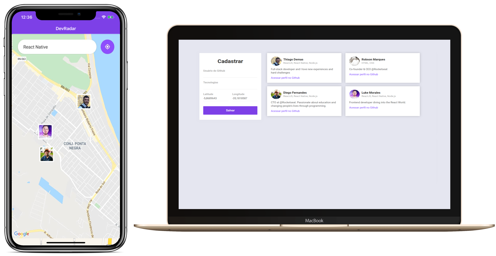

<h1 align="center">
    DEV RADAR
</h1>

<h4 align="center">
  🚀 Semana OmniStack 10.0
</h4>

 

  

## :rocket: Tecnologias

Esse projeto foi desenvolvido com as seguintes tecnologias:

- [Node.js](https://nodejs.org/en/)
- [React](https://reactjs.org)
- [React Native](https://facebook.github.io/react-native/)
- [Expo](https://expo.io/)

## 💻 Projeto

O DevRadar é um projeto que visa conectar desenvolvedores próximos a você que trabalham com as mesmas tecnologias.
